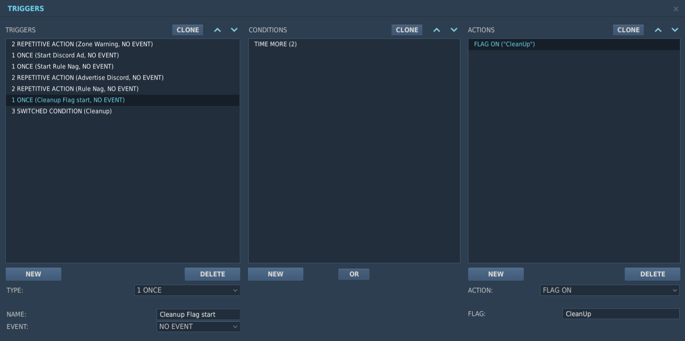
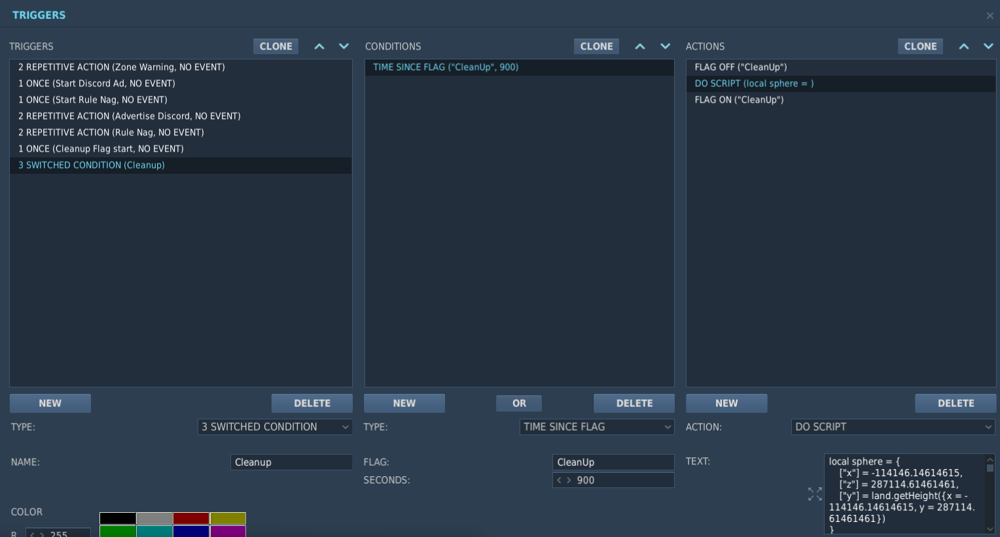

# DCS removeJunk Scripts
​
### Table of Contents
- [Description](#Description)
- [Clean Indvidual Zones](#Clean-Indvidual-Zones)
- [Clean Entire Map](#Clean-Entire-Map)
- [Remove When Unit Crashes](#Remove-When-Unit-Crashes)
​
### Description
I have created two removeJunk options. The third is an alternate version of [Asta's removeJunkWhenCrash](https://github.com/frasta/DCS_script_removeJunkWhenCrash/)

I started thinking about this while flying online and noticing that stutters strated happenening the longer the server ran. I assumed ED was clearing the map of extraneous items, but they never do. The more units that die just increases the number of items to render. While researching something else I saw a recommendation that mission creators should "clean up their mission periodically". Researching that, I found the function removeJunk.

I found some information that people stated this function crashes servers. In the DCS Changelog I noticed in Dec '24 that they put in a fix and requested server owners to test. I can not find any discussion since that update where anyone confirms if the issue is resolved or if the function still has issues. I have this function implemented on a server, but it has not been tested with multiple players over a longer period of time.
​
### Clean-Indvidual-Zones
Explanation coming soon
​
### Clean-Entire-Map
This script one script with two triggers. Ththis script can be put into an external script and be called however appropriate. My example shown here uses the built in trigger functionality. 

The GetTriggerZoneNames is put into a Once trigger to turn on a flag that the Switched trigger below watches 

The OneSphereCleansThemAll goes into a switched trigger. Here a flag is watched and after a set period from when the flag was turned on (900 seconds in my example, which is 15 minutes) the script runs. The script uses one sphere that covers the entire map. The trigger repeats until the end of the mission.

### Remove-When-Unit-Crashes
Explanation coming soon
​
