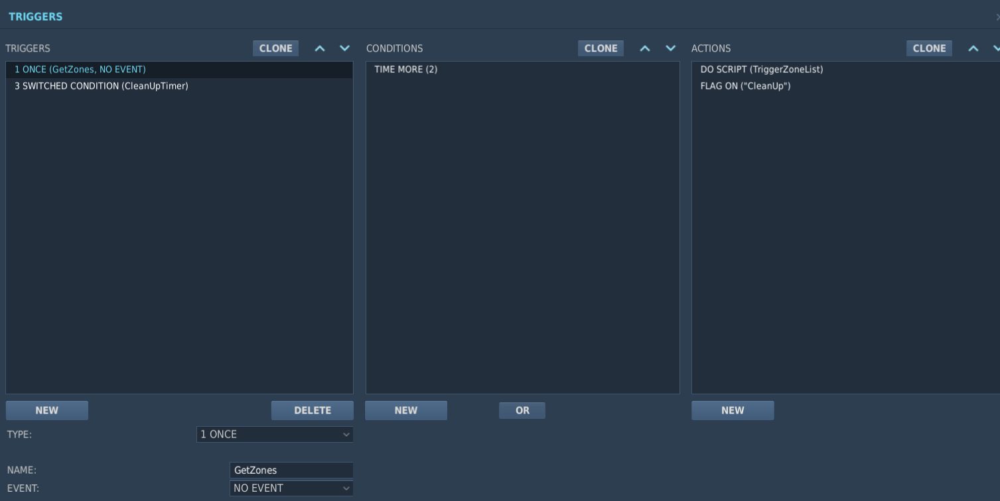
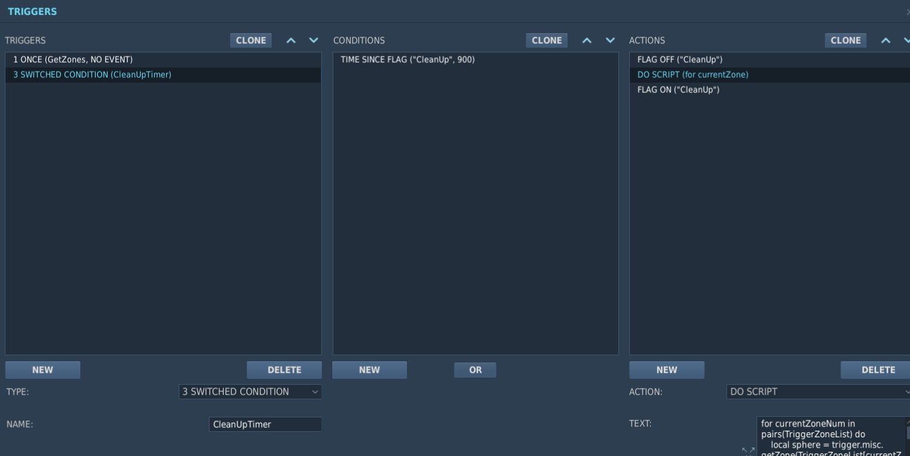
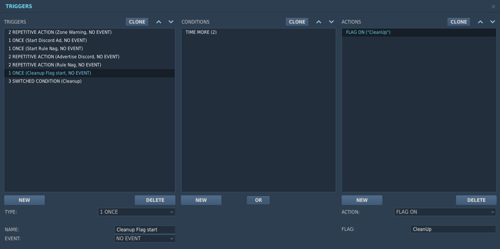
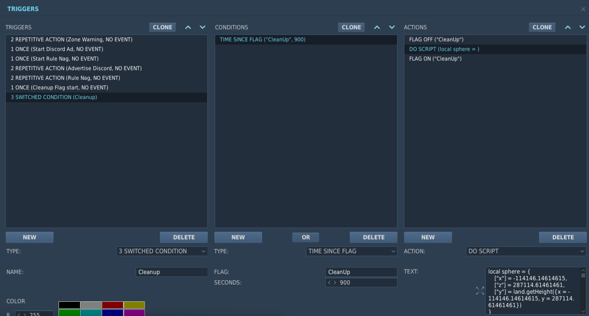

# DCS removeJunk Scripts
​
### Table of Contents
- [Description](#Description)
- [1 Clean Indvidual Zones](#1-Clean-Indvidual-Zones)
- [2 Clean Entire Map](#2-Clean-Entire-Map)
- [3 Remove When Unit Crashes](#3-Remove-When-Unit-Crashes)
- [4 GrInDmEtAl Version](#4-GrInDmEtAl-Version)
​
### Description
I have created two removeJunk options. The third is an alternate version of [Asta's removeJunkWhenCrash](https://github.com/frasta/DCS_script_removeJunkWhenCrash/)

I started thinking about this while flying online and noticing that stutters strated happenening the longer the server ran. I assumed ED was clearing the map of extraneous items, but they never do. The more units that die just increases the number of items to render. While researching something else I saw a recommendation that mission creators should "clean up their mission periodically". Researching that, I found the function removeJunk.

I found some information that people stated this function crashes servers. In the DCS Changelog I noticed in Dec '24 that they put in a fix and requested server owners to test. I can not find any discussion since that update where anyone confirms if the issue is resolved or if the function still has issues. I have this function implemented on a server, but it has not been tested with multiple players over a longer period of time.

Youtube example. Video is very short, you may need to replay a couple times.

​
### 1-Clean-Indvidual-Zones
This method is whe same as shown in [Hoggit's docs for removeJunk](https://wiki.hoggitworld.com/view/DCS_func_removeJunk). This has two files. The first (1_GetTriggerZoneNames) would be run when the mission starts to create an array of all trigger zones. The second (1_RemoveJunkInZones) is run how ever often you wish. This script is wrapped in a function so can be put into an external script and be called however appropriate. My example shown here uses the built in trigger functionality.

The GetTriggerZoneNames is put into a Once trigger and an action to turn on a flag that the Switched trigger below watches 

The RemoveJunkInZones goes into a switched trigger. Here a flag is watched and after a set period from when the flag was turned on (900 seconds in my example, which is 15 minutes) the script runs. The script uses the array of trigger zones to creat the spheres. The trigger repeats until the end of the mission.

​
### 2-Clean-Entire-Map
This script one script with two triggers. This script is wrapped in a function so it can be put into an external script and be called however appropriate. My example shown here uses the built in trigger functionality. 

The intial trigger is put into a Once trigger to turn on a flag that the Switched trigger below watches 

The OneSphereCleansThemAll is wrapped in a function so it can be put into an existing script file and called as appropriate. The example here shows the script put into a switched trigger. Here a flag is watched and after a set period from when the flag was turned on (900 seconds in my example, which is 15 minutes) the script runs. The script uses one sphere that covers the entire map. The trigger repeats until the end of the mission.

### 3-Remove-When-Unit-Crashes
*****This script is untested****
This script was reworked from [Asta's removeJunkWhenCrash](https://github.com/frasta/DCS_script_removeJunkWhenCrash/). The difference is Asta's version only removes blue units and only if they are inside of a zone. My version does red and blue units anywhere on the map. This script uses MIST, so you must load [MIST](https://github.com/mrSkortch/MissionScriptingTools/blob/development/mist_4_5_128.lua) prior to this script. The script is meant to be initialized and running as it uses the event listener, then there is a mist scheduler to cause a 3 second delay. I do not know how this script will run when multiple units crash together, in fact I don't know how well it will run in general.

### 4-GrInDmEtAl-Version
GrInDmEtAl made some modifications with some error checking here: [GrInDmEtAl's DCS-JUNK-CLEANER](https://github.com/GrInDmEtAl/DCS-JUNK-CLEANER)
